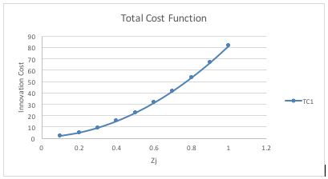

#Modelling Assignment 2: Green Growth

##Economics of Growth - Aghion and Howitt Chp.16

###1. Explain why, in contrast with the model of Chapter 16.4, both types of goods will be produced in equilibrium.

In the case of dirty machines being more productive than the clean machines, the model in chapter 16.4 demonstrated that clean machines will not be used in the final product sector of the economy.

However, the assumptions in the given case results in production of the clean machines as well. Contrary to the model in the book, there is a tax on profits for the dirty machine monopolists, giving a signal that adverse effects of dirty good production are punished. This might be an incentive for entrepreneurs to innovate on clean machines so that when the tax becomes a lot higher in the dirty machines sector making them unprofitable over clean machines, the monopolist in clean sector with the patent can reap huge profits.

That is why, in contrast with the model of Chapter 16.4, both types of goods will be produced in equilibrium, even if taxes might be currently not big enough to make dirty machines unprofitable.

###2. Derive an expression for expected marginal revenue from  innovation in each of the two sectors. Explain the role of the tax rate.
Expected marginal revenue function for the clean sector, including the potential benefits of the one period patent productivity enhancer.

$$ E\lbrack TR_{c}\rbrack = \ {Z_{c}\gamma P_{c}x}_{c} + (1 - Z_{c})P_{c}x_{c} $$

$$ E\lbrack TR_{c}\rbrack = \ Z_{c}\gamma\alpha^{(1 + \alpha)/(1 -\alpha)} A_{c} + (1 - Z_{c})\gamma\alpha^{(1 + \alpha)/(1 - \alpha)} A_{c} $$

$$ PTR_{c} = (1 - \gamma) \alpha^{(1 + \alpha)/(1 - \alpha)} A_{c} $$

Expected marginal revenue function for the dirty sector, including a possible productivity enhancer and a tax on contaminant activities.

$$E[TR_{d}] = (1 - \tau) Z_{d} \gamma P_{d}x_{d} + (1 - Z_{d})P_{d}x_{d}$$

$$E\lbrack TR_{d}\rbrack = (1 - \tau) Z_{d} \gamma \alpha^{(1 + \alpha)/(1 -\alpha)} A_{d} + (1 - Z_{d})\gamma \alpha^{(1 + \alpha)/(1 - \alpha)} A_{d} $$

$$ PTR_{d} = (1 - \tau)(1 - \gamma)\alpha^{(1 + \alpha)/(1 - \alpha)} A_{d}$$

The role of the tax is to reduce the monopolist’s profits when she produces the contaminant machines. Less expected profits in the current period will be an incentive to entrepreneurs to invest in clean R&D intensity next period due to the fact that there would be larger profits in that sector.

###3. The innovation cost function has two quadratic elements. Explain what mechanisms these two elements aim to capture.

The first quadratic term ${{\varepsilon z}_{j}}^{2}$ captures the amount of R&D inputs associated with a certain innovation probability intensity ($\ z_{j})$. The quadratic nature of innovation cost function implies that the cost increases at a steeper rate with respect to innovation probabilities, that is the marginal cost of improving innovation probabilities becomes greater as Z increases.

The second term $\theta{(z_{c} + z_{d})}^{2}$, captures the fact that all sectors could have access to a common knowledge source which needs extra R&D inputs. We can think of them as basic research. Both innovators have been developing innovations for both technologies and that common technological base is available to all innovator who want to to get the patent for the next period. The present innovator has to pay some compensation to the other innovators if he wants to use the common knowledge.

###4. Find an expression for the marginal cost of innovation in both sectors.

*Clean Innovator*

$$TC_{c} = A_{c}\lbrack \varepsilon z_{c}^{2} + \theta(z_{c} + z_{d})^{2} \rbrack/2\ $$

$$Mc_{c} = A_{c}\lbrack \varepsilon z_{c} + \theta(z_{c} + z_{d})\rbrack$$

and by symmetry

$$Mc_{d} = \ A_{d}\lbrack \varepsilon z_{c} + \theta(z_{d} + z_{c})\rbrack$$

###5. Use your answers in part b and d to solve for the equilibrium rate of innovation in both sectors,$z_{c}$ and $z_{d}$.

*Clean sector*

$$MR_{c} = MC_{c}$$

$$Z_{c}.\alpha^{2}{A_{c}}^{1 - \alpha}{X_{c}}^{\alpha - 1} = \ A_{c}\left\lbrack \text{εz}_{c} + \theta\left( z_{c} + z_{d} \right) \right\rbrack$$

$$ Z_{c} = (\alpha^{(1 + \alpha)/(1 - \alpha)}(\gamma - 1 ) - \theta Z_{c})/(\varepsilon + \theta)$$

*Dirty Sector*

$$MR_{d} = MC_{d}$$

$$ Z_{d} = (\alpha^{(1 + \alpha)/(1 - \alpha)}(\gamma - 1)(1 - \tau)-\theta Z_{d})/(\varepsilon + \theta)$$

###6. Solve for the minimum tax rate such that $Y = 0 $. Explain the implications for $S = 0$.

When $Y_{d} = 0$, it means that $g_{d} = 0$

$$ g_{d} = (A_{d,t + 1} - A_{d,t})/A_{d,t}$$

$$g_{d} = (\gamma(1 - \tau) Z_{d} A_{d} + (1 - Z_{d})( 1 - \tau) A_{d} - A_{d})/A_{d}$$

$$g_{d} = 0$$

$$(1 - \tau)(\gamma Z_{d} + 1 - Z_{d}) - 1 = 0$$

$$\tau = 1 - 1/(Z_{d}(\gamma - 1) + 1)$$

The implication for $S = 0$

If $Y_{d} = 0$, then the impact of contaminant production will remain constant over time

$$ S = S_{t + 1} - S_{t} = wS_{t} - \phi Y_{d} $$

If w ≥ $\phi$, the environmental stock will increase each period, or in the worst case, it will remain the same. However, if w < $\phi$, the environmental stock will deplete despite the fact that $Y_[d]=0$.

### 7. Compare your answers to the model in section 16.4

The answers in this model are slightly different compared to the model in section 16.4 due to the fact that our model does not contain labor in an explicit way. Also because of the presence of common knowledge stock and a subsequent quadratic innovation cost functions as a result of R&D externalities between the clean and dirty sectors, we obtained some slightly altered equilibriums with the same underlying economic intuitions.
